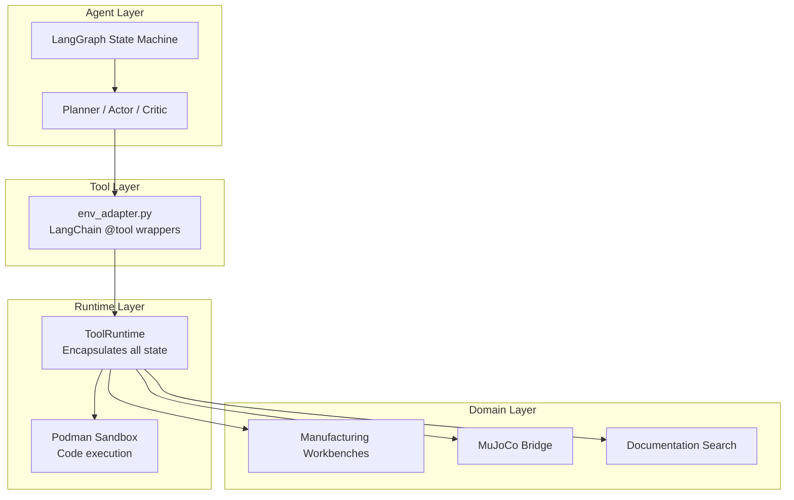
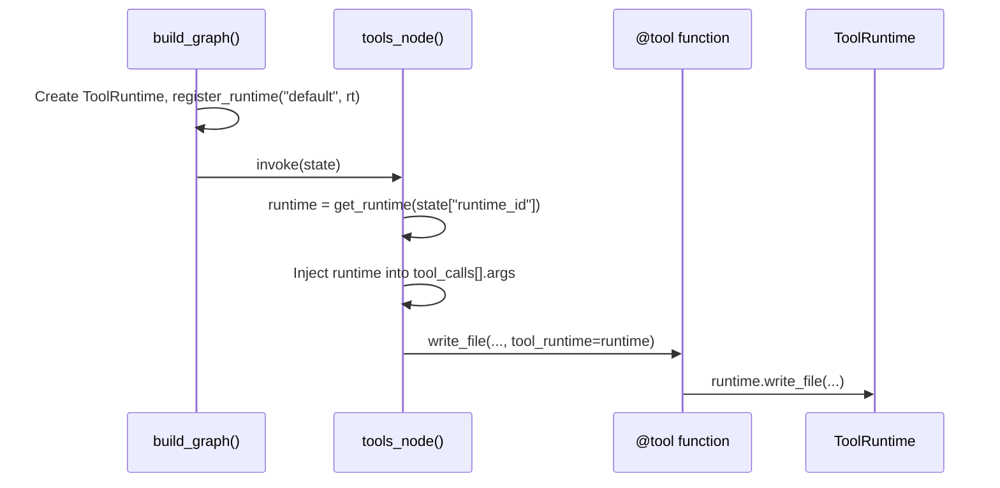

# Problemologist-AI Architecture

> **Purpose**: This document defines the structural decisions, integration patterns, and non-functional requirements that **all code in this repository must follow**. It supplements the feature specifications in `kitty-specs/`.

---

## 1. System Overview



---

## 2. Layer Responsibilities

### 2.1 Agent Layer (`src/agent/graph/`)

| Component | Responsibility | MUST NOT |
|-----------|---------------|----------|
| `graph.py` | Define node topology & routing | Import domain logic directly |
| `nodes/*.py` | LLM prompting & response parsing | Manage sessions or execute code |
| `state.py` | TypedDict for LangGraph state | Contain mutable singletons |

> [!IMPORTANT]
> Graph nodes are **stateless orchestrators**. Side effects (session start, file I/O) belong in the Runtime layer.

### 2.2 Tool Layer (`src/agent/tools/`)

| Component | Responsibility | MUST NOT |
|-----------|---------------|----------|
| `env_adapter.py` | LangChain `@tool` decorators, runtime injection | Contain business logic |
| Skill tools | Memory management wrappers | Access global state directly |

> [!TIP]
> Tools receive `tool_runtime` as an injected parameter. Never use global `_ACTIVE_ENV`.

### 2.3 Runtime Layer (`src/environment/`)

| Component | Responsibility | MUST NOT |
|-----------|---------------|----------|
| `runtime.py` | `ToolRuntime` class—single source of tool implementations | Import from `src/agent/` |
| `sandbox.py` | Podman orchestration | Execute code on host |
| `persistence.py` | SQLAlchemy episode/step logging | Create inline sessions |

### 2.4 Domain Layer

| Component | Location | Responsibility |
|-----------|----------|---------------|
| Workbenches | `src/workbenches/` | DFM validation & cost models |
| Simulation | `src/simulation_engine/`, `src/compiler/` | MuJoCo bridge & mesh generation |
| RAG | `src/rag/` | Documentation retrieval |

---

## 3. Non-Functional Requirements (NFRs)

### 3.1 Security: Sandbox Enforcement

> [!CAUTION]
> **All agent-generated code MUST execute inside the Podman sandbox.**

| Operation | Allowed | Forbidden |
|-----------|---------|-----------|
| `exec()` / `eval()` on agent code | ❌ Host | ✅ Sandbox only |
| File writes to workspace | ✅ Via `ToolRuntime` | ❌ Direct `Path.write_text()` |
| Network access | ❌ Always disabled | — |

**Enforcement**: The `ToolRuntime.run_command()` and preview/submit methods proxy to `Sandbox.run_script()`.

### 3.2 Single Source of Truth: Tool Registry

All tools available to the agent MUST be defined in **one location**:

```python
# src/agent/tools/registry.py (TO BE CREATED)
from src.agent.tools.env_adapter import (
    write_file, edit_file, view_file, run_command,
    preview_design, submit_design, search_docs,
    check_manufacturability, lint_script,
    search_parts, preview_part,
)
from src.agent.tools.memory import read_journal

AGENT_TOOLS = [
    write_file, edit_file, view_file, run_command,
    preview_design, submit_design, search_docs,
    check_manufacturability, read_journal,
    search_parts, preview_part, lint_script,
]
```

Consumers (`graph.py`, `actor.py` fallback) import from `registry.py`.

### 3.3 No Global Mutable State

| Pattern | Status |
|---------|--------|
| `_ACTIVE_ENV` global | ⚠️ Legacy, do not extend |
| `_RUNTIMES` registry | ✅ Acceptable (keyed by ID) |
| Creating fallback singletons | ❌ Forbidden |

**Preferred**: Pass `runtime_id` through `AgentState`, retrieve via `get_runtime(runtime_id)`.

### 3.4 Error Handling

```python
# ❌ Forbidden
try:
    risky_operation()
except:
    pass

# ✅ Required
try:
    risky_operation()
except SpecificError as e:
    logger.warning(f"Operation failed: {e}")
    return fallback_value
```

### 3.5 Logging Over Print

| Pattern | Status |
|---------|--------|
| `print("DEBUG: ...")` | ❌ Forbidden |
| `logger.debug(...)` | ✅ Required |

Use `logging.getLogger(__name__)` at module level.

---

## 4. Integration Patterns

### 4.1 Runtime Injection Flow



### 4.2 Session Lifecycle

Sessions belong to the **graph runner**, not individual nodes:

```python
# runner.py (correct)
async def run_agent(problem: str):
    runtime = ToolRuntime(workspace_dir="workspace")
    runtime.start_session("agent-session")
    try:
        graph = build_graph()
        # ... invoke graph
    finally:
        runtime.stop_session()
```

### 4.3 Workbench Integration

Workbenches are instantiated by `ToolRuntime.__init__()`:

```python
self._workbenches = {
    "cnc": CNCWorkbench(),
    "injection_molding": InjectionMoldingWorkbench(),
    "3d_print": Print3DWorkbench(),
}
```

Domain code (workbenches, simulation) MUST NOT import from `src/agent/`.

---

## 5. Configuration

All configuration flows through `src/agent/utils/config.py` (Pydantic Settings):

```python
from src.agent.utils.config import Config

model = Config.LLM_MODEL          # ✅ Correct
model = os.getenv("LLM_MODEL")    # ❌ Avoid
```

Path constants:

- `Config.WORKSPACE_DIR` — agent workspace root
- `Config.SKILLS_DIR` — `.agent/skills/` location
- `Config.PROMPTS_PATH` — `config/prompts.yaml`

---

## 6. Decision Log

| Date | Decision | Rationale |
|------|----------|-----------|
| 2026-02-03 | Remove Gymnasium `gym.Env` inheritance | Not training RL; added complexity without benefit |
| 2026-02-03 | Consolidate to `ToolRuntime` | Eliminate global state, enable multi-agent |
| 2026-02-03 | Require sandbox for all exec | Security; prevent host compromise |

---

## 7. Future Considerations

1. **Multi-Agent Support**: Replace `_ACTIVE_ENV` with explicit runtime passing via state.
2. **Proper RAG**: Replace substring matching with embedding-based retrieval.
3. **Structured Completion Signals**: Use `AgentState.task_complete` flag instead of magic string matching.
