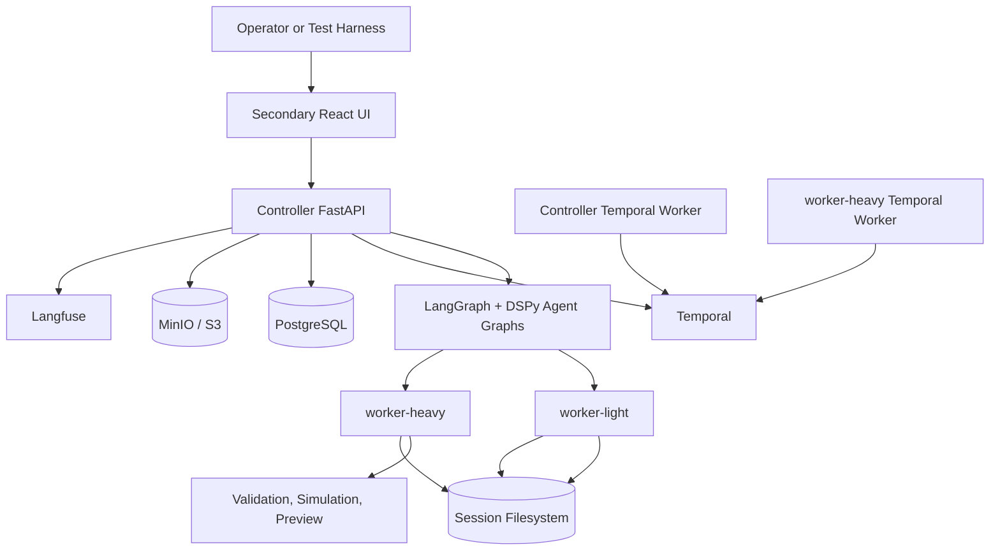

# Problemologist-AI - System Architecture

**Date:** 2026-03-20

## Architecture Diagram

```mermaid
flowchart TD
    User[Operator or Test Harness] --> Frontend[Secondary React UI]
    Frontend --> Controller[Controller FastAPI]
    Controller --> Graph[LangGraph + DSPy Agent Graphs]
    Controller --> Temporal[Temporal]
    ControllerWorker[Controller Temporal Worker] --> Temporal
    HeavyWorkerTemporal[worker-heavy Temporal Worker] --> Temporal
    Controller --> DB[(PostgreSQL)]
    Controller --> Storage[(MinIO / S3)]
    Controller --> Langfuse[Langfuse]
    Graph --> Light[worker-light]
    Graph --> Heavy[worker-heavy]
    Light --> SessionFS[(Session Filesystem)]
    Heavy --> Simulation[Validation, Simulation, Preview]
    Heavy --> SessionFS
    Light --> SessionFS
```

## Runtime Layers

| Layer            | Responsibility                                                                                                 | Key Files                                                                                                                   |
| ---------------- | -------------------------------------------------------------------------------------------------------------- | --------------------------------------------------------------------------------------------------------------------------- |
| Controller       | Owns HTTP APIs, agent graphs, orchestration, persistence, and policy enforcement                               | `controller/api/main.py`, `controller/agent/graph.py`, `controller/middleware/remote_fs.py`, `controller/clients/worker.py` |
| Worker Light     | Owns workspace filesystem access, shell execution, git, linting, asset serving, and lightweight inspection     | `worker_light/app.py`, `worker_light/api/routes.py`                                                                         |
| Worker Heavy     | Owns geometry validation, physics simulation, preview rendering, manufacturing analysis, and submission gating | `worker_heavy/app.py`, `worker_heavy/api/routes.py`                                                                         |
| Temporal Workers | Own durable long-running tasks and heavy activity dispatch                                                     | `controller/temporal_worker.py`, `worker_heavy/temporal_worker.py`                                                          |
| Frontend         | Secondary operator UI for episodes, traces, assets, simulation output, and feedback                            | `frontend/src/App.tsx`, `frontend/src/pages/EngineerWorkspace.tsx`, `frontend/src/pages/BenchmarkGeneration.tsx`            |

## Agent Graphs

| Graph               | Stage Order                                                                                 | Review Gates                                                                    | Output Artifacts                                                                                                                          |
| ------------------- | ------------------------------------------------------------------------------------------- | ------------------------------------------------------------------------------- | ----------------------------------------------------------------------------------------------------------------------------------------- |
| Benchmark Generator | Planner -> Plan Reviewer -> Coder -> Reviewer                                               | Plan review before implementation, execution review after validation/simulation | `plan.md`, `todo.md`, `benchmark_definition.yaml`, `benchmark_assembly_definition.yaml`, renders, review manifests                        |
| Engineer            | Planner -> Plan Reviewer -> Coder -> Electronics Reviewer when needed -> Execution Reviewer | Plan review before coding, execution review after validated simulation          | `plan.md`, `todo.md`, `benchmark_definition.yaml`, `assembly_definition.yaml`, `script.py`, renders, simulation results, review manifests |

The benchmark generator produces problems that the engineer graph later solves. The engineer graph consumes the benchmark definition as read-only context and must stay within the cost, weight, and handover constraints defined by the benchmark and workbench schemas.

## Boundary Contracts

| Contract                      | What It Means                                                                                         | Implementation Anchor                                                                                                       |
| ----------------------------- | ----------------------------------------------------------------------------------------------------- | --------------------------------------------------------------------------------------------------------------------------- |
| Session isolation             | Each episode uses its own worker session filesystem and trace identity                                | `controller/clients/worker.py`, `shared/workers/filesystem/router.py`                                                       |
| Policy enforcement            | Path permissions and visual inspection are driven by `config/agents_config.yaml`                      | `shared/agents/config.py`, `controller/middleware/remote_fs.py`                                                             |
| Heavy single-flight admission | A worker-heavy instance accepts one active heavy job at a time                                        | `worker_heavy/app.py`, `worker_heavy/api/routes.py`                                                                         |
| Validation-preview split      | `/benchmark/validate` emits fast preview artifacts and does not act as the Genesis parity path        | `worker_heavy/api/routes.py`, `shared/simulation/schemas.py`                                                                |
| Handoff gating                | Planner and reviewer transitions are gated by strict manifest and artifact checks                     | `controller/agent/node_entry_validation.py`, `controller/agent/review_handover.py`, `worker_heavy/utils/file_validation.py` |
| Tool routing                  | Controller-side script tools proxy validation, simulation, and submission through the worker boundary | `controller/api/routes/script_tools.py`, `controller/middleware/remote_fs.py`                                               |

## Data Flow

1. The frontend calls the controller API when the UI is in use.
2. The controller creates or resumes an episode and stores it in PostgreSQL.
3. The controller drives a LangGraph agent graph with DSPy ReAct nodes.
4. The controller proxies filesystem and shell operations to worker-light and routes heavy operations through Temporal-backed worker-heavy workflows.
5. The workers write artifacts into the isolated session filesystem and the controller persists the resulting traces, assets, and review records.
6. The frontend reads the episode detail payload when needed and renders traces, models, videos, heatmaps, and circuit views. Backend state remains authoritative.

## Observability and Storage

| Signal                    | Where It Lands                                     | Why It Matters                                                                   |
| ------------------------- | -------------------------------------------------- | -------------------------------------------------------------------------------- |
| Episode and trace records | PostgreSQL                                         | Lets the UI and eval tooling reconstruct the run                                 |
| Worker events             | DB and Langfuse                                    | Captures tool calls, reasoning traces, simulation outcomes, and review decisions |
| Assets                    | MinIO-backed object storage and episode asset rows | Stores renders, videos, MJCF, and other large outputs                            |
| Session files             | Worker filesystem                                  | Holds the live artifacts used by the agent nodes                                 |
| Review manifests          | Session filesystem and database-backed traces      | Gates reviewer entry and keeps handoff checks deterministic                      |

## Secondary Frontend Surface

The dashboard has two secondary user-facing views:

| View               | Route        | Purpose                                                                          |
| ------------------ | ------------ | -------------------------------------------------------------------------------- |
| Engineer Workspace | `/`          | Shows the live reasoning trace, workspace artifacts, and design viewport         |
| Benchmark Pipeline | `/benchmark` | Shows benchmark generation state, preview artifacts, and review workflow context |
| Settings           | `/settings`  | Holds runtime and connection controls                                            |

`UnifiedGeneratorView` is the shared layout for both views. It combines a trace/chat column, a viewport, and an artifact panel. The viewport switches between 3D models, simulation video, heatmaps, and electronics views depending on the available artifacts. This UI is secondary to the backend runtime and is only needed for inspection or UI-specific work.

## Important Constraints

| Constraint                                               | Practical Effect                                                                       |
| -------------------------------------------------------- | -------------------------------------------------------------------------------------- |
| Integration tests are the primary verification path      | New behavior should be checked with the real services and HTTP boundaries              |
| Visual inspection is policy-driven                       | If renders exist for a role that requires them, the role must use `inspect_media(...)` |
| Shared models are strict                                 | Core handover artifacts use Pydantic models with unknown-field rejection               |
| Benchmarks and solutions are different ownership domains | Benchmark-owned fixtures are read-only context for the engineer graph                  |
| `main.py` is not the canonical service entry point       | Use the controller and worker apps instead                                             |
