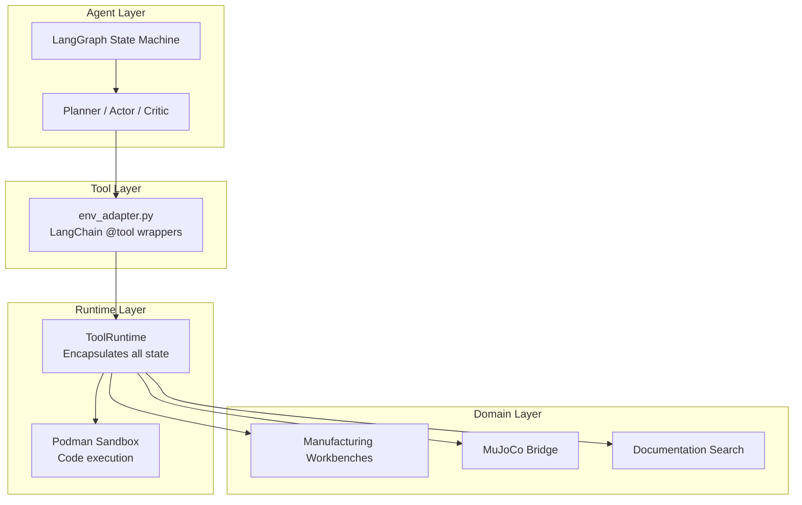
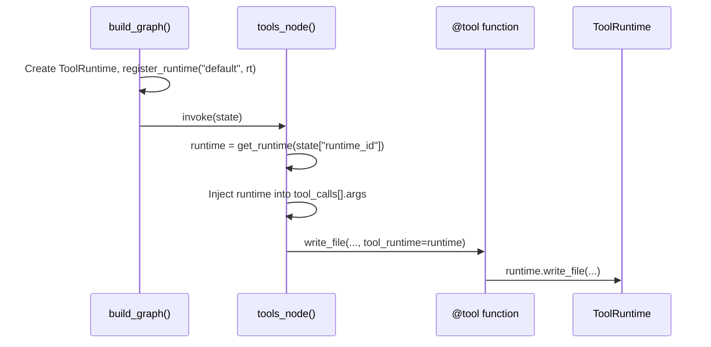

# Problemologist-AI Architecture

> **Purpose**: This document defines the structural decisions, integration patterns, and non-functional requirements that **all code in this repository must follow**. It supplements the feature specifications in `kitty-specs/`.

---

## 1. System Overview



---

## 2. Layer Responsibilities

### 2.1 Agent Layer (`src/agent/graph/`)

| Component | Responsibility | MUST NOT |
|-----------|---------------|----------|
| `graph.py` | Define node topology & routing | Import domain logic directly |
| `nodes/*.py` | LLM prompting & response parsing | Manage sessions or execute code |
| `routing.py` | State-based graph transitions | Use magic string matching for control flow |

> [!IMPORTANT]
> Graph nodes are **stateless orchestrators**. Side effects (session start, file I/O) belong in the Runtime layer.
> Control flow transitions MUST use structured state flags (e.g., `state["task_complete"]`) rather than parsing LLM content for magic strings like "Task complete".

### 2.2 Tool Layer (`src/agent/tools/`)

| Component | Responsibility | MUST NOT |
|-----------|---------------|----------|
| `env_adapter.py` | LangChain `@tool` decorators, runtime injection | Contain business logic |
| Skill tools | Memory management wrappers | Access global state directly |

> [!TIP]
> Tools receive `tool_runtime` as an injected parameter. Never use global `_ACTIVE_ENV`.

### 2.3 Runtime Layer (`src/environment/`)

| Component | Responsibility | MUST NOT |
|-----------|---------------|----------|
| `runtime.py` | `ToolRuntime` class—Sole orchestrator of tool execution | Import from `src/agent/` |
| `evaluator.py` | Shared `Evaluator` for design analysis & costing | Duplicate logic in tools |
| `sandbox.py` | Podman orchestration | Execute code on host |
| `persistence.py` | SQLAlchemy episode/step logging | Create inline sessions |

> [!NOTE]
> `CADEnv` has been deprecated/removed in favor of direct `ToolRuntime` usage to eliminate global state.

### 2.4 Domain Layer

| Component | Location | Responsibility |
|-----------|----------|---------------|
| Workbenches | `src/workbenches/` | DFM validation & cost models |
| Simulation | `src/simulation_engine/`, `src/compiler/` | MuJoCo bridge, MJCF schema validation & mesh generation |
| RAG | `src/rag/` | Documentation retrieval |

---

## 3. Non-Functional Requirements (NFRs)

### 3.1 Security: Sandbox Enforcement

> [!CAUTION]
> **All agent-generated code MUST execute inside the Podman sandbox.** This includes design scripts, skill updates, and analysis routines.

| Operation | Allowed | Forbidden |
|-----------|---------|-----------|
| `exec()` / `eval()` on agent code | ❌ Host | ✅ Sandbox only |
| `subprocess.run` on agent code | ❌ Host | ✅ Sandbox only |
| File writes to workspace | ✅ Via `ToolRuntime` | ❌ Direct `Path.write_text()` |
| Network access | ❌ Always disabled | — |

**Enforcement**:

- The `ToolRuntime` proxies all command/script execution to `Sandbox.run_script()`.
- Use of `subprocess` or `exec` on the host with agent-provided strings is a critical security violation.
- Skill updates via `update_skill` must be validated/linted within the sandbox before being synced to the host.

### 3.2 Single Source of Truth: Tool Registry

To prevent quadruplication and ensure consistency, all tools available to the agent MUST be defined in **one location**:

```python
# src/agent/tools/registry.py
from src.agent.tools.env_adapter import (...)
from src.agent.tools.memory import read_journal

AGENT_TOOLS = [ ... ]
```

**Consumers**: `graph.py` and fallback logic in `actor.py` MUST import from `registry.py`. Adding a tool to the system must only require adding it to this registry.

### 3.3 No Global Mutable State

| Pattern | Status |
|---------|--------|
| `_ACTIVE_ENV` / `_CURRENT_ROLE` | ❌ Forbidden (Legacy—must be removed) |
| `_RUNTIMES` registry | ✅ Acceptable (keyed by UUID) |
| Creating fallback singletons | ❌ Forbidden |

**Requirement**: Tools must receive the `ToolRuntime` instance via dependency injection (the `tool_runtime` argument in `@tool` functions). Never rely on module-level globals for environment or session state.

### 3.4 Error Handling

```python
# ❌ Forbidden
try:
    risky_operation()
except:
    pass

# ✅ Required
try:
    risky_operation()
except SpecificError as e:
    logger.warning(f"Operation failed: {e}")
    return fallback_value
```

### 3.5 Communication Protocol: Structured JSON

> [!WARNING]
> **Avoid "Marker Protocols"** (e.g., parsing `stdout` for `SUBMIT_RESULT: { ... }`).

**Requirement**: Communication between the host and sandboxed runner scripts MUST use structured file-based I/O:

1. Runner script writes its results to a pre-defined JSON file (e.g., `result.json`) in the workspace.
2. `ToolRuntime` reads and parses this file after the script terminates.
3. Magic strings in `stdout` are strictly for human-readable logging and MUST NOT be used for control logic.

### 3.6 Structured Logging

| Pattern               | Status       |
|-----------------------|--------------|
| `print("DEBUG: ...")` | ❌ Forbidden |
| `logger.debug(...)`   | ✅ Required  |

**Standard**:

- Use `logging.getLogger(__name__)` at the module level.
- Prefer structured logging (e.g., passing context as dict) to allow machine parsing.
- Debug statements MUST NOT be left in production code unless using an appropriate low log level.

### 3.7 Workspace Isolation

To enable parallel execution (e.g., `pytest -n auto`) and prevent race conditions:

- **Test Workspaces**: Every test run MUST use a unique, isolated directory (e.g., via `uuid.uuid4()` or `pytest`'s `tmp_path`).
- **Generator Workspaces**: Benchmark and scenario generation runs MUST use unique subdirectories within the main workspace to prevent cross-contamination.
- **Teardown**: Automated cleanup of temporary workspaces is required unless explicitly disabled for debugging.

---

## 4. Integration Patterns

### 4.1 Runtime Injection Flow



### 4.2 Session Lifecycle

Sessions belong to the **graph runner**, not individual nodes:

```python
# runner.py (correct)
async def run_agent(problem: str):
    runtime = ToolRuntime(workspace_dir="workspace")
    runtime.start_session("agent-session")
    try:
        graph = build_graph()
        # ... invoke graph
    finally:
        runtime.stop_session()
```

### 4.3 Workbench Integration

Workbenches are instantiated by `ToolRuntime.__init__()`:

```python
self._workbenches = {
    "cnc": CNCWorkbench(),
    "injection_molding": InjectionMoldingWorkbench(),
    "3d_print": Print3DWorkbench(),
}
```

Domain code (workbenches, simulation) MUST NOT import from `src/agent/`.

---

## 5. Configuration

All configuration flows through `src/agent/utils/config.py` (Pydantic Settings):

```python
from src.agent.utils.config import Config

model = Config.LLM_MODEL          # ✅ Correct
model = os.getenv("LLM_MODEL")    # ❌ Avoid
```

Path constants:

- `Config.WORKSPACE_DIR` — agent workspace root
- `Config.SKILLS_DIR` — `.agent/skills/` location
- `Config.PROMPTS_PATH` — `config/prompts.yaml`

> [!IMPORTANT]
> **ALL paths MUST be absolute** and derived from `Config` (for legacy) or `src/utils/paths.py` (preferred). Hardcoding paths relative to the current working directory is strictly forbidden.

---

## 6. Decision Log

| Date | Decision | Rationale |
|------|----------|-----------|
| 2026-02-03 | Remove Gymnasium `gym.Env` inheritance | Not training RL; added complexity without benefit |
| 2026-02-03 | Consolidate to `ToolRuntime` | Eliminate global state, enable multi-agent |
| 2026-02-03 | Require sandbox for all exec | Security; prevent host compromise |
| 2026-02-03 | File-based Simulation Exchange | Robustness; decouple simulation from shell injection |
| 2026-02-03 | MJCF Schema Linting | Early error detection for generated models |

---

## 7. Future Considerations

1. **Proper RAG**: Replace substring matching with embedding-based retrieval and a vector database.
2. **Context Window Management**: Implement automated message windowing/summarization to keep token costs down and reasoning quality high.
3. **Multi-Part Project Support**: Move beyond the single `design.py` assumption to support hierarchical project structures.
