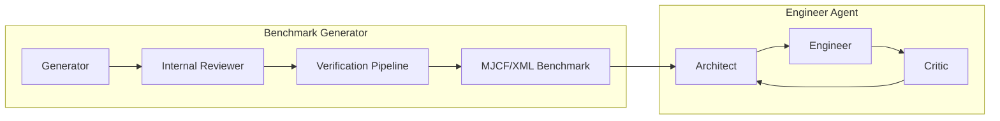
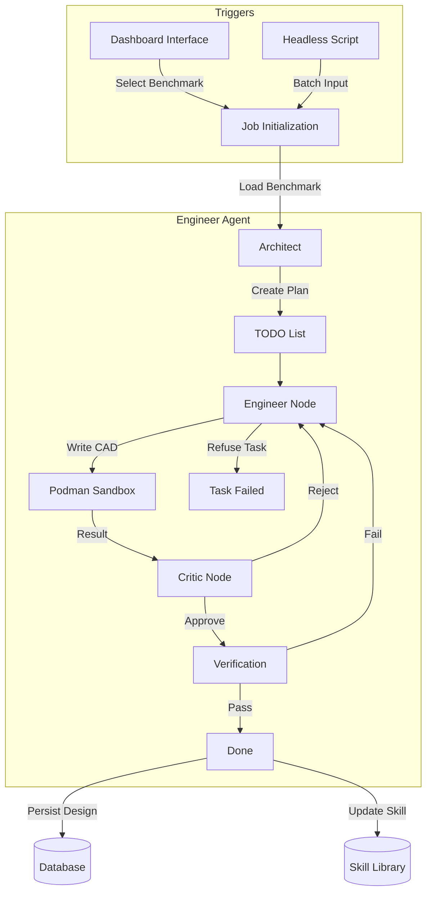

# Problemologist-AI Architecture

> **Purpose**: This document defines the structural decisions, integration patterns, and non-functional requirements that **all code in this repository must follow**. It unifies the high-level agentic vision with concrete technical constraints.

---

## 1. System Overview: The Two Agents

The system is composed of two primary autonomous agent graphs that interact with the domain:

1. **Benchmark Generator Agent**: Creates, validates, and compiles dataset problems (benchmarks) consisting of CAD models and descriptions.
2. **Engineer Agent**: Solves these problems by designing CAD models under constraints (cost, manufacturability, weight, materials).

### 1.1 Core Philosophy

* **Fail Fast**: Early termination is preferred over complex fallback logic. The system should prioritize the "happy path" and fail quickly if requirements are not met.
* **Lean Code**: Avoid "innovative" or overly complex code that increases maintenance burden. Use battle-tested best practices.
* **No Redundant Fallbacks**: Avoid deep nesting of fallback mechanisms which lead to outdated codebases and subtle bugs. Rule: use assertions over fallbacks. If something fails, we rather update it.



---

## 2. Benchmark Generator Architecture

**Goal**: Create randomized, valid CAD benchmarks converted into MJCF (MuJoCo XML) format to ensure data distribution and robustness.

### 2.1 Workflow

1. **Generation**: The agent generates a CAD model based on randomized parameters.
2. **Internal Review**: A specialized critic node reviews the design for logic and feasibility.
3. **Verification**: Strict validity checks before acceptance:
    * **Geometry**: Check for self-intersections and non-manifold geometry.
    * **Compilation**: Ensure the generated code compiles/executes without error.
    * **MJCF Validity**: Validate against the official MJCF XML schema.
    * **Simulation**: Run a few frames of simulation to ensure physical stability.

### 2.2 Environment Support

* **Static & Dynamic Objects**: Support for generating environments with fixed and moving parts.
* **Motors**: Specification of actuators (currently without complex wiring).
* **Validity**: Problems must be *provably* creatable in MuJoCo.

---

## 3. Engineer Agent Architecture

**Goal**: Solve the provided benchmarks by generating valid manufacturing designs.

### 3.1 Roles

The Engineer Agent is a graph composed of specialized roles:

| Role | Responsibility |
|------|----------------|
| **Architect (Planner)** | Break down the problem, design the high-level approach, and persist a **TODO List**. |
| **Engineer (Actor)** | Implement the CAD solution according to the TODO list. Can **refuse the plan** if proven impossible. |
| **Critic** | Review the implementation against constraints (cost, weight, manufacturability). |

### 3.2 Capabilities

* **Constraint Handling**: Must strictly adhere to max cost, weight, and manufacturing limits (e.g., CNC milling tooling restrictions).
* **Preview Tools**: Can run "Preview" commands to check manufacturability/validity *without* incurring a penalty or failing the task.
* **Skill Learning**:
  * Agents can create and update **Skills** (persistent reusable tools/functions).
  * Successful solutions (after resolving failures) update the long-term memory (Skills).
  * **Storage**: Representative skills for the system are kept in `.agent/skills/` (repo root), while learned agent skills are persisted in the database/workspace.
* **Long-Running Tasks**: Execution can take significant time (10+ minutes) in production; system must handle timeouts gracefully.

---

## 4. Technical Architecture

### 4.1 Layer Responsibilities

| Layer | Components | Responsibility |
|-------|------------|----------------|
| **Agent Layer** | `graph.py`, `nodes/` | LangGraph state machines, prompting, decision making. **Stateless**. |
| **Domain Layer** | `workbenches/`, `simulation/` | DFM validation, cost models, MuJoCo bridge, RAG. Pure logic. |
| **Runtime Layer** | `ToolRuntime`, `PodmanSandbox` | **Stateful** orchestration, side-effect management, container control. |
| **Tool Layer** | `env_adapter`, `registry` | Maps Agent actions to Runtime methods. |

### 4.2 Non-Functional Requirements (NFRs)

#### 4.2.1 Security: Sandbox Enforcement

> [!CAUTION]
> **All agent-generated code MUST execute inside the Podman sandbox.**

* **Host**: Orchestration only. No `exec()`, `eval()`, or `subprocess` on agent strings.
* **Container**: All "unsafe" code (design scripts, skill verification) runs here.
* **Environment Code**: Supporting code (models, utils) MUST be baked into the container image or mounted read-only. **Do not use runtime string injection.**

#### 4.2.2 Communication Protocol: OpenAPI

> [!IMPORTANT]
> Communication between the Host and the Container Agent is strictly typed.

* **Protocol**: HTTP (via FastAPI/Uvicorn in container).
* **Schema**: **OpenAPI**. All data exchange must conform to defined Pydantic models served via `fastapi`.
  * **Strict Typing**: All schemas MUST be strictly typed (enums, constraints) to facilitate automated testing.
  * **Validation**: `schemathesis` checks are run against the OpenAPI schema to ensure robustness and compliance.
* **Control**: Host sends HTTP requests to the Container Agent to start jobs, query status, or retrieve results.

#### 4.2.3 Isolation & Parallelism

* **Test Isolation**: Every test run uses a unique UUID-based workspace.
* **Container Isolation**: Each agent instance gets a dedicated container/runtime.
* **Parallel Execution**: Benchmark generation and CAD simulation MUST run in parallel.
* **Scaling**: The system MUST scale to at least 4 concurrent containers on a 4-core CPU, with an architecture that allows for future distribution across nodes (IPv6 ready).

#### 4.2.4 Observability & Data Collection

* **Full Traceability**: Record 100% of agent inputs and outputs, including:
  * **Thoughts**: Internal reasoning and planning.
  * **Pass/Fail Reasons**: Granular details on why a step succeeded or failed.
  * **Error Logs**: Full tracebacks and linting errors from script execution.
  * **Conversation Structure**: The entire tool-calling and message history.
  * **Image renders**
* **Utility**: This data is stored in the master SQLite database for later use in querying, preprocessing, and model training (RL/Fine-tuning).

#### 4.2.5 Data Persistence & Backups (Production)

* **Local Storage**: Files generated by the agent are stored locally and synced to the container workspace as needed.
* **Backups**: Daily backups of the SQLite database to S3.
  * **Compression**: All backups must be highly compressed (e.g., zstd/xz) before upload.
  * **Cron Endpoint**: The system implements an endpoint that triggers the backup process, intended to be called by a daily cron job.

---

## 5. Integration Patterns

### 5.1 Tool Registry

All tools are defined in a central registry to ensure the Engineer and Benchmark agents share the same capabilities where appropriate.

```python
# src/agent/tools/registry.py
AGENT_TOOLS = [ ... ]
```

### 5.2 Persistence & State

* **SQLite/SQLAlchemy**: Used for persisting run logs, episodes, and steps.
* **LangGraph Checkpointer**: Used for agent state persistence.
* **No Global State**: `_ACTIVE_ENV` patterns are forbidden. State is passed via `ToolRuntime` instances.

---

## 6. Decision Log

| Date | Decision | Rationale |
|------|----------|-----------|
| 2026-02-04 | **Fail Fast Principle** | Prioritize "happy path" and early termination over complex fallback logic to maintain code hygiene. |
| 2026-02-04 | **Strict Observability** | Record all agent thoughts and error details for future model training and debugging. |
| 2026-02-04 | **Daily Backups** | Implement S3 backup strategy for production durability. |
| 2026-02-04 | **Strict Schema Enforcement** | Use `schemathesis` and strict Pydantic typing to eliminate edge-case communication errors. |
| 2026-02-04 | **OpenAPI Communication** | Replace file-based JSON with robust HTTP/FastAPI for host-container bridge. |
| 2026-02-04 | **Two-Agent Split** | Separate Benchmark Generation from Problem Solving (Engineer) for clearer evaluation. |
| 2026-02-04 | **Baked-in Env Code** | Remove runtime code injection; prefer mounting/baking for stability and security. |
| 2026-02-03 | **Podman Sandbox** | Require containerization for all dynamic code execution. |

## 7. Future Considerations

1. **Reflective RL**: Use "Expected Solutions" from the Planner to guide RL optimization based on recorded agent thoughts.
2. **Context Management**: Automated context window compression for long-running engineer tasks.
3. **Advanced Wiring**: Future updates should handle motor wiring and electrical constraints.
4. **Distributed Nodes**: Scaling the runtime beyond a single host (IPv6/Distributed Podman).

---

## 8. End-to-End Workflows

### 8.1 Benchmark Generator Flow

Illustrates how a benchmark is requested via Dashboard (UI) or Headless (CLI), generated, verified, and saved.

```mermaid
graph TD
    subgraph Triggers
        UI["Dashboard Interface"] -->|Config JSON| Init
        CLI["Headless Script"] -->|Config JSON| Init
    end

    Init[Job Initialization] -->|Launch Container| Generator
    
    subgraph Benchmark Generator Agent
        Generator[Generator Node] -->|Draft CAD| Reviewer
        Reviewer[Internal Reviewer] -->|Feedback| Generator
        Reviewer -->|Approved| Verify
        
        subgraph Verification
            Verify[Verification Pipeline] -->|Check| Geom[Geometry Check]
            Verify -->|Check| Sim[Simulation Check]
            Verify -->|Check| Schema[MJCF Schema]
        end
    end
    
    Geom -- Fail --> Generator
    Sim -- Fail --> Generator
    Schema -- Fail --> Generator
    
    Verify -->|Success| Output[Save Benchmark (MJCF/XML)]
    Output --> DB[(Database)]
```

### 8.2 Engineer (Solver) Flow

Illustrates how the Engineer agent picks up a benchmark (via Dashboard or CLI), plans, solves, and persists the solution/skill.


